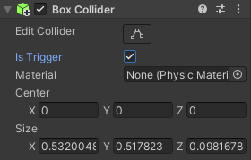

Add a collider to the GameObject that needs to react to a collision and enable 'Is Trigger' in the Inspector. 

Make sure the GameObject that will collide with it also has a collider. 

Add `OnTriggerEnter` and/or `OnTriggerExit` methods to the GameObject with 'Is Trigger' enabled. 

--- code ---
---
language: csharp
filename: 
line_numbers: false
line_number_start: 
line_highlights: 
---
    void OnTriggerEnter(Collider other)
    {
        if(other.gameObject.tag == "Player")
        {
            Debug.Log("Player arrived");
        }
    }
    
    void OnTriggerExit(Collider other)
    {
        if(other.gameObject.tag == "Player")
        {
            Debug.Log("Player left");
        }
    }
--- /code ---

**Debug:** Remember to enable 'Is Trigger' and make sure both GameObjects have a collider. 
