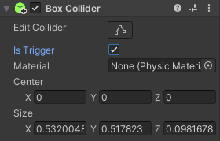

Ajoute un collider au GameObject qui doit réagir à une collision et active « Is Trigger » dans l'Inspector.

Assure-toi que le GameObject qui entrera en collision avec lui possède également un collider.

Ajoute les méthodes `OnTriggerEnter` et/ou `OnTriggerExit` au GameObject dont l'option « Is Trigger » est activée.

--- code ---
---
language: csharp
filename: 
line_numbers: false
line_number_start: 
line_highlights: 
---

    void OnTriggerEnter(Collider other)
    {
        if(other.gameObject.tag == "Joueur")
        {
            Debug.Log("Le joueur est arrivé");
        }
    }
    
    void OnTriggerExit(Collider other)
    {
        if(other.gameObject.tag == "Joueur")
        {
            Debug.Log("Le joueur est parti");
        }
    }
--- /code ---

**Debogage :** n'oublie pas d'activer « Is Trigger » et de t'assurer que les deux GameObjects ont un collider. 
